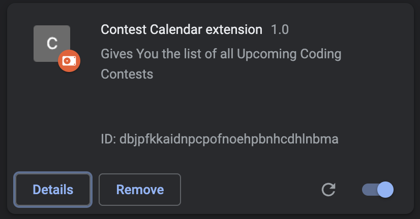
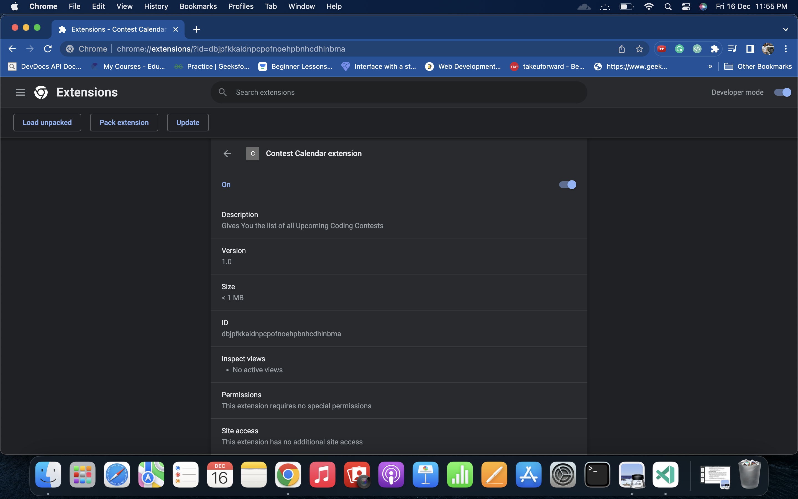
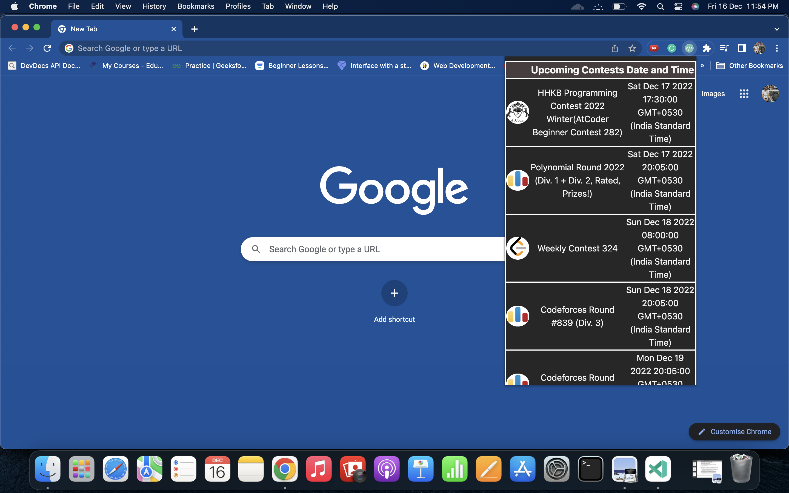

### Techie Calender

<hr>


A cross-browser extension to provide information about the upcoming contests on following platforms: 

<ul>
<li> <a href="https://CodeForces.com" >CodeForces</a></li> 
<li> <a href="https://CodeChef.com" >CodeChef</a></li> 
<li> <a href="https://LeetCode.com" >LeetCode</a></li> 
<li> <a href="https://AtCoder.com" >AtCoder</a></li> 
<li> <a href="https://TopCoder.com" >TopCoder</a></li> 
<li> <a href="https://HackerRank.com" >HackerRank</a></li> 
<li> <a href="https://HackerEarth.com" >HackerEarth</a></li> 
<li> <a href="https://codingcompetitions.withgoogle.com/kickstart/" >Google Kick Start</a></li> 
</ul>

<hr>
It is a light-weight browser extension which runs in the menu bar. It provides information about the upcoming coding contests on various Platforms

**Note**: The extension uses the following API :
* https://kontests.net/api/v1/all


## :heavy_check_mark: Features
* Provides information about upcoming coding contests
* Uses IST (+GMT 5:30) 
* Supports major online coding platforms

<hr>

## :arrow_down: Installation 
Clone the source code locally:

```sh
$ git clone https://github.com/mishrarahul07/Techie-Calendar.git
$ cd Techie-Calendar
```

### Google Chrome
* Go to `chrome://extensions/` and enable `Developer mode`
* Click on `load unpacked` and select the folder containing `manifest.json` file
* Pin this extension to use it.

### Mozilla Firefox
* Go to `about:debugging` and click on `This Firefox` (if you are not already there)
* Click on `Load Temporary Add-on...` and select the `manifest.json` file
* The addon will appear next to the address bar only when you are on leetcode

### Microsoft Edge
* follow steps in this [link](https://www.windowscentral.com/how-install-non-store-extensions-microsoft-edge)

<hr>

## :handshake: Contribution
Contributions are always welcomed, here is what you need to do:
1. Work on an existing issue or create a new one [here](https://github.com/mishrarahul07/Techie-Calendar/issues)
2. Create a pull request linked to that issue

Know more about [pull request](https://docs.github.com/en/free-pro-team@latest/github/collaborating-with-issues-and-pull-requests/about-pull-requests).
## :earth_asia: Development Env Tools
* Mozilla Firefox 83.0
* Google Chrome 87.0

<hr>

## :computer: Working Screenshots
* Manage Extensions




* Chrome Extensions Demo


<hr>

## :clipboard: License
MIT © <a href = "https://www.linkedin.com/in/mishra-rahul07/" target="_blank">Rahul Mishra</a>
